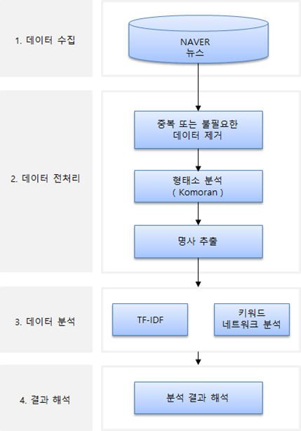

## 📰 텍스트 마이닝을 활용한 코로나19 관련 뉴스 타이틀 분석
 

<small>짧은 기간 내에 **`주제 선정, 데이터 수집(크롤링), 데이터 전처리, 분석, 페이퍼 작성`**을 진행하다 보니, 다소 미흡한 부분이 있을 수 있습니다.   
업무 외 시간을 최대한 활용하여 최선을 다해 연구하였으니, 부족한 점이 있더라도 너른 양해 부탁드립니다.  

갈아엎기를 몇 차례 반복하고, 밤샘은 기본으로 했었던... 힘들지만, 재밌고 즐거웠던 기억이 새록새록   
2022년에 작성한 코드이기에, (라이브러리나 패키지 변경으로 인해) 파일 실행시 에러 발생할 수 있습니다.
</small> 

 

> **[Analysis of news titles related to COVID-19 using text mining]**  
**[`📰 paper 보기`](/Analysis%20of%20news%20titles%20related%20to%20COVID-19%20using%20text%20mining.pdf)**

🧑‍🦱 **참여 인원**: 1명   

📅 **연구 기간**: 2022.06.05 ~ 2022.06.21  

🔍 **연구 절차**  

📜 **.ipynb 파일**  
- 클릭하면 해당 폴더로 이동됩니다.
1. [`데이터 수집: /data_crawling`](/data_crawling)
1. [`데이터 전처리: /data_preprocessing`](/data_preprocessing)  
1. [`데이터 분석: /data_analysis`](/data_analysis)
