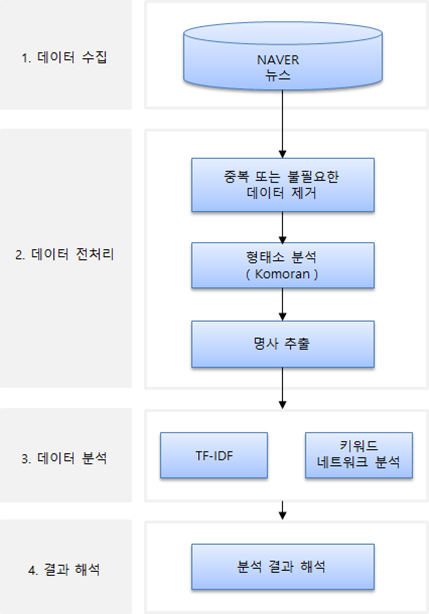

## 📰 텍스트 마이닝을 활용한 코로나19 관련 뉴스 타이틀 분석
 

> ℹ️  
> 짧은 기간 내에 **주제 선정, 데이터 수집(크롤링), 데이터 전처리, 분석, 페이퍼 작성**을 진행하다 보니, 다소 미흡한 부분이 있을 수 있습니다.  
> 해보신 분들은 아시겠지만, 여러 번 갈아엎기를 반복한 끝에 나온 결과물입니다.  
> 업무 외 시간을 최대한 활용하여 최선을 다해 연구하였으니, 부족한 점이 있더라도 너른 양해 부탁드립니다.

 

> **[Analysis of news titles related to COVID-19 using text mining]**  
**[📰 paper 보기](/Analysis%20of%20news%20titles%20related%20to%20COVID-19%20using%20text%20mining.pdf)**

📅 **연구 기간**: 2022.06.05 ~ 2022.06.21  

🧑‍🦱 **참여 인원**: 1명   

🔍 **연구 절차**  

