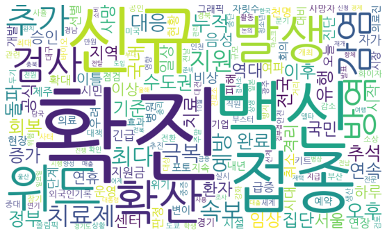
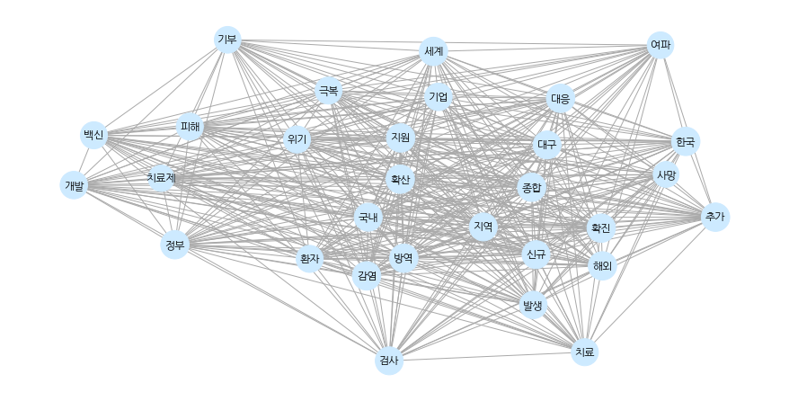
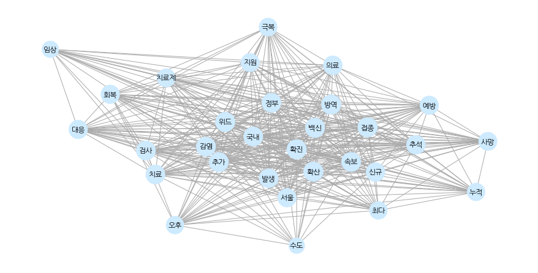
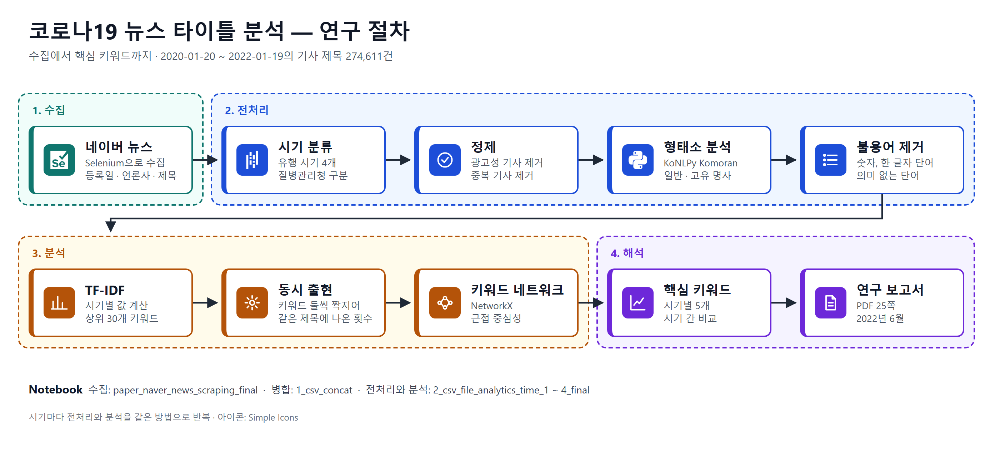

# 텍스트 마이닝을 활용한 코로나19 관련 뉴스 타이틀 분석

**코로나19 유행 2년 동안 뉴스 제목에서 어떤 단어가 중심이었는지를 시기별로 분석한 연구**

네이버 뉴스에서 코로나19 관련 기사 제목 약 27만 건을 수집해 유행 시기 4개로 나누고,
시기마다 TF-IDF로 핵심 키워드 30개를 뽑은 뒤 키워드 네트워크에서 중심이 되는 단어를 찾았습니다.

<p>
  
  
</p>

제1기(왼쪽)와 제4기(오른쪽)의 Word Cloud입니다.

> 2022년 6월에 혼자 진행한 연구입니다. 당시 코드 그대로라서 지금은 Package 변경이나 네이버 화면 변경으로 실행되지 않을 수 있습니다.

| | |
|---|---|
| 데이터 | 네이버 뉴스 기사 제목 274,611건 (2020-01-20 ~ 2022-01-19) |
| 수집 | Selenium을 이용한 Web Scraping, 검색어 `코로나19` · `코로나바이러스` |
| 전처리 | Komoran 형태소 분석, 일반 명사와 고유 명사 추출, 불용어 제거 |
| 분석 | TF-IDF 상위 30개 키워드, 키워드 네트워크의 근접 중심성 |
| 실행 환경 | Google Colab, Jupyter Notebook |

**더 읽기**: [Wiki](https://github.com/youneedpython/Analysis-of-news-titles-related-to-COVID-19-using-text-mining/wiki) · [연구 보고서 (PDF, 25쪽)](Analysis%20of%20news%20titles%20related%20to%20COVID-19%20using%20text%20mining.pdf)

---

## 결과

### 시기별 핵심 키워드

TF-IDF 상위 30개 키워드로 네트워크를 만들고, 근접 중심성이 높은 5개를 뽑았습니다.

| 시기 | 기간 | 핵심 키워드 |
|---|---|---|
| 제1기 | 2020-01-20 ~ 2020-08-11 | 국내 · 감염 · 방역 · 지원 · 확산 |
| 제2기 | 2020-08-12 ~ 2020-11-12 | 국내 · 신규 · 방역 · 추가 · 확진 |
| 제3기 | 2020-11-13 ~ 2021-07-06 | 백신 · 예방 · 접종 · 확진 · 추가 |
| 제4기 | 2021-07-07 ~ 2022-01-19 | 위드 · 방역 · 백신 · 접종 · 확진 |

- **2020년(제1기, 제2기)**: `국내`와 `방역`이 함께 나옵니다. 거리두기 같은 국내 방역 지침에 관심이 모였습니다.
- **2021년 이후(제3기, 제4기)**: `백신` · `접종` · `확진`이 함께 나옵니다. 백신 승인과 접종으로 관심이 옮겨 갔습니다.
- **제4기에만**: `위드`가 중심에 들어옵니다. 방역 정책이 "위드 코로나"로 바뀐 시기입니다.

### 시기별 TF-IDF 상위 10개

| 순위 | 제1기 | 제2기 | 제3기 | 제4기 |
|---|---|---|---|---|
| 1 | 확진 | 확진 | 확진 | 확진 |
| 2 | 극복 | 신규 | 백신 | 백신 |
| 3 | 지원 | 확산 | 접종 | 신규 |
| 4 | 확산 | 발생 | 신규 | 접종 |
| 5 | 감염 | 백신 | 검사 | 발생 |
| 6 | 대응 | 감염 | 발생 | 검사 |
| 7 | 신규 | 방역 | 감염 | 위드 |
| 8 | 발생 | 극복 | 확산 | 확산 |
| 9 | 치료 | 치료 | 지원 | 감염 |
| 10 | 사망 | 지원 | 추가 | 치료 |

- 네 시기 모두에 나온 키워드는 16개입니다: 감염 · 검사 · 국내 · 극복 · 대응 · 발생 · 방역 · 백신 · 사망 · 신규 · 지원 · 추가 · 치료 · 치료제 · 확산 · 확진.
- 한 시기에만 나온 키워드도 있습니다. 제1기 `여파` · `피해` · `개발` · `대구` · `기부`, 제2기 `자릿수` · `긴급`, 제4기 `위드` · `회복` 등입니다.
- 시기별 상위 30개 전체와 TF-IDF 값은 [보고서](Analysis%20of%20news%20titles%20related%20to%20COVID-19%20using%20text%20mining.pdf) 4장에 있습니다.

### 키워드 네트워크

<p>
  
  
</p>

제1기(왼쪽)와 제4기(오른쪽)입니다. 제2기와 제3기의 그림은 [`images/`](images/)에 있습니다.

---

## 분석 내용

### 1. 데이터 수집

- 네이버 뉴스 검색 결과에서 기사의 등록일, 언론사, 제목을 수집했습니다. 본문은 수집하지 않았습니다.
- 기간을 짧게 나눠 검색하고, 결과를 기간별 파일로 저장했습니다.
- 수집한 데이터 파일은 저장소에 없습니다.

### 2. 전처리

- 수집한 기사를 유행 시기 4개로 분류합니다.
- 코로나19와 관련 없는 광고성 기사와 중복 기사를 제거합니다.
- Komoran으로 형태소를 분석해 일반 명사(`NNG`)와 고유 명사(`NNP`)만 남깁니다.
- 숫자와 `명` · `때` 같은 불용어, 한 글자 단어를 제거합니다. 명사 추출과 불용어 제거는 결과를 보며 반복했습니다.

### 3. TF-IDF

- 시기마다 단어의 TF-IDF 값을 계산해 상위 30개를 핵심 키워드로 뽑습니다.
- Library의 TF-IDF 기능을 쓰지 않고 Notebook에서 직접 계산했습니다.

### 4. 키워드 네트워크

- 상위 30개 키워드를 둘씩 짝지어, 같은 제목에 함께 나온 횟수를 셉니다.
- 키워드를 Node, 함께 나온 관계를 Link로 하는 네트워크를 NetworkX로 만듭니다.
- 근접 중심성이 높은 5개를 그 시기의 핵심 키워드로 봅니다.

---

## 분석은 어떻게 설계했나요?

| 단계 | 기준 |
|---|---|
| 분석 대상 | 기사 제목만 (본문 제외) |
| 수집 기간 | 국내 첫 확진자 발생일(2020-01-20)부터 2년 |
| 시기 구분 | 질병관리청의 코로나19 2년 보고서가 나눈 유행 시기 4개 |
| 품사 | 일반 명사, 고유 명사 |
| 핵심 키워드 수 | 시기별 TF-IDF 상위 30개 |
| 중심성 지표 | 근접 중심성 |

시기별 데이터 규모:

| 시기 | 기간 | 일수 | 기사 제목 수 |
|---|---|---|---|
| 제1기 | 2020-01-20 ~ 2020-08-11 | 205 | 78,611 |
| 제2기 | 2020-08-12 ~ 2020-11-12 | 93 | 36,000 |
| 제3기 | 2020-11-13 ~ 2021-07-06 | 236 | 108,000 |
| 제4기 | 2021-07-07 ~ 2022-01-19 | 197 | 52,000 |
| 합계 | | 731 | 274,611 |

### 한계

- **기사 제목만 분석했습니다.** 보고서도 학술 논문이나 SNS 같은 다른 자료를 함께 볼 필요가 있다고 적었습니다.
- **네이버 뉴스 한 곳에서만 수집했습니다.**
- **분석 기법이 TF-IDF와 네트워크 분석 두 가지입니다.** Topic Modeling 같은 다른 기법은 쓰지 않았습니다.
- **시기별 기사 수가 고르지 않습니다.** 제2기는 36,000건, 제3기는 108,000건입니다.

---

## 구성



| Notebook | 역할 |
|---|---|
| [`data_crawling/paper_naver_news_scraping_final.ipynb`](data_crawling/paper_naver_news_scraping_final.ipynb) | 네이버 뉴스 검색 결과에서 등록일, 언론사, 제목 수집 |
| [`data_preprocessing_analysis/1_csv_concat.ipynb`](data_preprocessing_analysis/1_csv_concat.ipynb) | 기간별로 저장한 CSV를 시기별 파일 4개로 병합 |
| [`data_preprocessing_analysis/2_csv_file_analytics_time_1_final.ipynb`](data_preprocessing_analysis/2_csv_file_analytics_time_1_final.ipynb) | 제1기 전처리, TF-IDF, 키워드 네트워크 |
| `..._time_2_final.ipynb` ~ `..._time_4_final.ipynb` | 제2기 ~ 제4기에 같은 분석 적용 |

분석 Notebook에는 보고서에 쓰지 않은 Word Cloud와 Word2Vec 실험도 들어 있습니다.

## 기술 스택

| 영역 | 기술 |
|---|---|
| 수집 | Python, Selenium, BeautifulSoup |
| 전처리 | KoNLPy (Komoran), pandas |
| 분석 | NetworkX, NLTK, gensim (Word2Vec) |
| 시각화 | Matplotlib, WordCloud |
| 실행 환경 | Google Colab, Jupyter Notebook |

저장소에 `requirements.txt`가 없어 Version은 기록되어 있지 않습니다.

## 재현 방법

| 항목 | 내용 |
|---|---|
| 실행 순서 | 수집 Notebook → `1_csv_concat.ipynb` → 시기별 분석 Notebook 4개 |
| 데이터 | 저장소에 없음. 수집 Notebook으로 다시 모아야 함 |
| 수집 | Chrome과 ChromeDriver 필요, Local에서 실행 |
| 분석 | Google Colab에서 실행 (Google Drive의 CSV를 읽음, 한글 Font 설치 포함) |

지금 그대로 재현하기는 어렵습니다.

- 네이버 뉴스 검색 화면이 2022년과 달라졌다면 수집 코드가 동작하지 않습니다.
- `1_csv_concat.ipynb`가 쓰는 `DataFrame.append`는 pandas 2.0에서 없어졌습니다.
- 2026-10-06 문서 정리 때 Notebook을 다시 실행하지는 않았습니다. 이 README의 수치는 보고서와 Notebook에 남아 있는 출력에서 옮겼습니다.

---

## 프로젝트 구조

```text
.
├── Analysis of news titles related to COVID-19 using text mining.pdf   연구 보고서
├── data_crawling/
│   └── paper_naver_news_scraping_final.ipynb     네이버 뉴스 제목 수집
├── data_preprocessing_analysis/
│   ├── 1_csv_concat.ipynb                        시기별 CSV 병합
│   └── 2_csv_file_analytics_time_{1~4}_final.ipynb   시기별 전처리와 분석
└── images/                                       연구 절차, Word Cloud, 키워드 네트워크
```

| | |
|---|---|
| 참여 인원 | 1명 |
| 연구 기간 | 2022-06-05 ~ 2022-06-21 |
